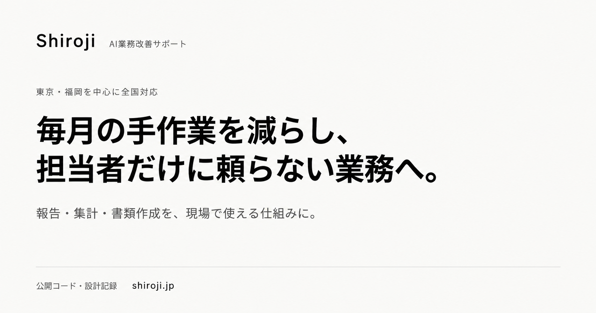

# Shiroji｜AI業務改善の公開コード・設計記録

日々の業務の「手入力」を減らすために、実際に作って動かしているツール集です。
Excelの転記、シフト作成、報告書づくり。**毎回やっているけれど、誰も得していない作業**を、1つずつ仕組みに置き換えてきた記録をまとめています。

自分の業務やクライアント支援で制作したツールを、公開コードまたは事例紹介としてまとめています。
**運用中・試験運用中・開発済みで停止中**のものがあり、状態は各READMEに記載しています。
うまくいった構成だけでなく、途中で設計を変えた理由や踏んだ地雷も、各READMEに残しています。

**Shiroji** ／ AI業務改善サポート

[公式サイト](https://shiroji.jp/) ・ [料金・支援内容](https://shiroji.jp/#price) ・ [無料相談](https://shiroji.jp/#contact)

## 支援していること

**毎月の手作業を減らし、担当者だけに頼らない業務へ。**
報告・集計・書類作成を中心に、業務の整理からツール制作、使い方の定着まで支援します。

- **入力・転記・集計**：スマホでの実績報告から一覧・定期レポートまでをつなぐ
- **作業ルールの整理**：シフトや定型書類の作成手順を、ほかの担当者も操作できる仕組みにする
- **管理する数字の整理**：仕入れ単価・原価・目標との差を確認できる形にする

AI・Excel・Googleスプレッドシートなどを、現場の作業に合わせて使います。
既製サービスで足りる場合や、制作費に対して効果が見合わない場合は、作らない判断も含めて提案します。

---

## ツール一覧

| ツール | 何を解決したか | 技術 | 状態 |
|---|---|---|---|
| [cost-management-tool](cost-management-tool/) | 仕入れ単価・使用量・原価を連動し、目標との差を一覧に | スプレッドシート＋GAS | 現場展開済み・使い勝手を調整中 |
| [shift-scheduler](shift-scheduler/) | 属人化していた月次シフト作成を2〜3時間→30分に。運営管理者がボタン操作で回せる形に | GAS / Sheets / Forms | 運用中 |
| [sales-report-form](sales-report-form/) | スマホの実績入力から一覧へつなぎ、管理者の再入力を減らす | GAS | 運用中 |
| [kpi-reporter](kpi-reporter/) | 週次の売上集計とレポート送信を自動化 | GAS | 運用中 |
| [meeting-bot](meeting-bot/) | 会議音声から議事録を作り、チャットへ自動投稿 | Python / Whisper / Claude | 開発済み・現在停止 |
| [ai-news-line-bot](ai-news-line-bot/) | 10ソースのAIニュースを毎朝7時にLINEへ配信 | GAS | 毎日稼働中 |
| [research-agent](research-agent/) | 5エージェント並列でWeb調査、本文まで読んで深掘り | Python | 運用中 |
| [local-transcriber](local-transcriber/) | 音声の文字起こしを、外部送信なしでMac内で完結 | faster-whisper | 運用中 |
| [slide-generator](slide-generator/) | 構成メモから、ブランド統一のPPTXを自動生成 | Node.js | 運用中 |
| [video-production](video-production/) | 縦型の告知動画を、会話ベースで制作・納品 | Claude Code スキル | 納品実績あり |
| [presentation-extensions](presentation-extensions/) | 登壇用のレーザーポインターとタイマー | Chrome拡張 (MV3) | 運用中 |
| [tokyo-art-events](tokyo-art-events/) | 14館の展覧会情報を毎日自動収集して公開 | GitHub Actions | [公開中](https://tokyo-art-events.vercel.app) |
| [landing-page](landing-page/) | 店舗情報と予約導線の整理／ShirojiのサービスLP・見積書デモ | HTML / CSS / JavaScript | 店舗LP・自社LPともに公開中 |

---

## 主な事例

### 食材原価の見える化（飲食業・現場展開後の調整中）

仕入れ単価を更新すると、原価率・目標との差・適正販売価格・値上げアラートまでが自動で再計算されるスプレッドシート（5シート構成＋GAS連携）です。

- Googleフォームからのスマホ入力で、**伝票入力から原価率の更新までが一気通貫**
- 担当者が入力する項目と、計算で求める項目を整理し、現場と管理者が同じ数字を確認できる形に
- **現場への展開後、入力方法や表示内容の使い勝手をすり合わせ中**。利益改善・作業時間削減の効果は数値として掲載していません
- v1→v8で潰した8つの設計上の問題（IFERRORで捕まらないバグ、最新単価を行順で判定していた構造欠陥など）を記録

> 原価率・仕入れ単価・損益額などの経営数値は**一切公開していません**。公開するのは設計の記録のみで、ソース・実物ファイルも含みません。

詳細 → [cost-management-tool/README.md](cost-management-tool/README.md)

### シフト作成の自動化（運用中）

毎月**2〜3時間**かかり、かつ**作成者の頭の中にルールがある**状態だった月次シフト作成を、
Google Forms → スプレッドシート → GAS の流れで自動化しました。
**自分が毎月やっていた業務を、自分で仕組みに変えたもの**です。

- 作成時間が**2〜3時間 → 約30分**に（担当者による概算・確認と手直しを含む。店舗の条件により異なります）
- **非エンジニアの運営管理者が、ボタン操作だけで**シフト案を生成できる状態に（作れる人が1人から増えた）
- 希望休の優先配置・公休の自動割当・連勤上限・最低出勤人数・役職者配置を自動判定
- ロジックで表現しきれない例外（研修出勤・会社指定休）は、**自動配置より優先される「確定シフト」層**を作って吸収
- 設定値をすべて設定シートに逃がし、**毎月の変更にエンジニアが不要**な形に
- テンプレート化により、新店舗へはコードを書き換えずに展開可能

完全自動ではなく、**人が確認すべき場所を機械が指し示す**設計にしています（人数不足・役職者不在の日を色と判定行で可視化）。

詳細 → [shift-scheduler/README.md](shift-scheduler/README.md)

### 店舗ランディングページ（飲食業・公開中）

ブランドガイドラインがない状態から、実店舗の写真と公式SNSの実投稿を参照して世界観を組み立てたランディングページです。

- 掲載情報は予約サイト・公式サイト・プレスリリースを突き合わせ、**価格と営業時間の食い違いを確認してから**反映
- 来店意欲の温度感に合わせ、**予約導線を3系統**（ネット予約・電話・SNS）に分けてヘッダーに常時固定
- ビルドツールを使わない単一HTMLで、ホスティング先を選ばない構成

> ページ自体は店舗が公開しているものですが、ソースは店舗側の資産のため本リポジトリには含めていません。

詳細 → [landing-page/README.md](landing-page/README.md)

---

## 自社サイト・体験デモ

[Shiroji公式サイト](https://shiroji.jp/)では、代表事例3件、支援の進め方、料金、無料相談窓口を公開しています。

- **[見積書作成デモ](https://shiroji.jp/#builders)**：工事項目・数量・単価から見積明細の下書きを計算。内装工事を題材にした自作サンプルで、実際の導入事例ではありません
- デモの金額・工事内容は架空です。入力内容は送信・保存せず、画面内で計算します
- 最終的な項目・単価の判断、発行前の確認は担当者が行う想定です

## 登壇・研修

福岡県筑紫野市の生涯学習センターで、市民向けのAI活用講座に登壇しています。

- **全4回・のべ53名**が受講
- 初めての方にも、その場で操作しながら学べる講座を実施
- 第4回の受講者アンケートには「前回の講座より、仕事でAIを使うことが増えた」との声をいただいています

講座の運営自体も、このリポジトリの [slide-generator](slide-generator/)・[presentation-extensions](presentation-extensions/)・[video-production](video-production/) で回しています。

---

## そのほかのツール

### 業務自動化

- **[meeting-bot](meeting-bot/)** — 会議音声をWhisperで文字起こしし、Claudeで議事録・要約を生成してGoogle Chatへ自動投稿。処理済みファイルは自動アーカイブ。**現在は運用停止**（既製サービスで足りると判断した経緯をREADMEに記載）
- **[sales-report-form](sales-report-form/)** — 現場スタッフがスマホから実績を入力するGAS製フォーム。ホワイトリスト検証で不正入力を防ぎ、LockServiceで同時送信の競合を回避。kpi-reporterと組み合わせて「入力→蓄積→集計→送信」を一気通貫に
- **[kpi-reporter](kpi-reporter/)** — 週次の売上データを自動集計し、サマリーレポートを生成・送信するGASツール。時間主導型トリガーで自動実行

### 情報収集・リサーチ

- **[research-agent](research-agent/)** — Web・YouTube・Wikipedia・Reddit・トレンドの5エージェントが並列調査し、Round 1の結果からサブクエリを自動生成して深掘り。記事はスニペットではなく本文を全文取得。有料APIへの依存を意図的に排除（切替の経緯もREADMEに記録）
- **[ai-news-line-bot](ai-news-line-bot/)** — OpenAI・Google DeepMind公式ブログ、Hacker News、Reddit、ITmedia AI+など10ソースを横断収集し、英語タイトルは自動翻訳して毎朝7:00にLINEへ配信
- **[local-transcriber](local-transcriber/)** — faster-whisperによる音声の文字起こしをMac上で完結。外部に音声を送らずに済むため、機密性のある会議にも使える

### 制作・登壇支援

- **[slide-generator](slide-generator/)** — 構成メモをJSONで渡すだけでブランド統一のPPTXを生成。7種類のスライドタイプ、文字量に応じたフォントサイズ自動計算、`brand` の差し替えで企業向けにも転用可能
- **[video-production](video-production/)** — Claude Codeのスキルスタック（video-use + HyperFrames）による会話ベースの動画制作。実例として20秒の縦型告知動画（1080×1920）を制作・納品（実写合成／カラーグレード／トランジション／BGM選定）
- **[presentation-extensions](presentation-extensions/)** — 登壇用に自作したChrome拡張2種（Manifest V3）。iframe内のスライドでも動くレーザーポインターと、フルスクリーン対応のカウントダウンタイマー。外部通信なし・権限は最小限。**実際の講座で使用中**

### 公開Webサイト

- **[tokyo-art-events](tokyo-art-events/)** — 東京都内14館の展覧会情報をGitHub Actionsで毎日自動収集し、地図付きで一覧できる公開サイト。開催状況フィルタ・検索に対応 → [tokyo-art-events.vercel.app](https://tokyo-art-events.vercel.app)

---

## こんな方に

- シフト作成・売上集計など、定型業務に毎月まとまった時間を取られている
- 同じ情報を、Excelと自社サイトとポータルに何度も入力し直している
- 見積書や報告書の作成が、特定の人しかできない状態になっている
- AIを業務に取り入れたいが、何から始めればいいか分からない

## 作者

**Shiroji** ／ AI業務改善サポート
[運営者プロフィール](https://shiroji.jp/#about)
2026年7月 開業

通信業界でマネジメントに携わりながら、AIを使った業務改善を支援しています。
**東京・福岡を中心に、全国出張対応。オンラインも全国対応**です。

## 相談・料金

- **ミニ業務改善プラン：30,000円（税込）**。実績づくりのための特別価格。1業務を対象に、業務整理・合意したツールの制作と動作確認・修正・使い方ガイドを提供
- 納期は、対応内容の合意と必要な情報が揃ってから**原則2週間**。納品後2週間は操作相談と、合意内容どおりに動かない不具合の修正に対応
- 継続サポートは月額応相談、社内向けAI活用研修は1回90分〜・内容により応相談
- 有料サービス利用料や追加機能・別業務への対応は別途相談

料金・条件は2026年9月12日の公開LPに合わせています。最新情報は[公式サイトの料金欄](https://shiroji.jp/#price)をご確認ください。
[無料ヒアリング（オンライン30〜60分）の相談はこちら](https://shiroji.jp/#contact)。

## 今後追加予定

- **sns-copy-generator** — 商品写真からSNS投稿文を自動生成
- **video-series** — 複数シーン動画の自動編集テンプレート
