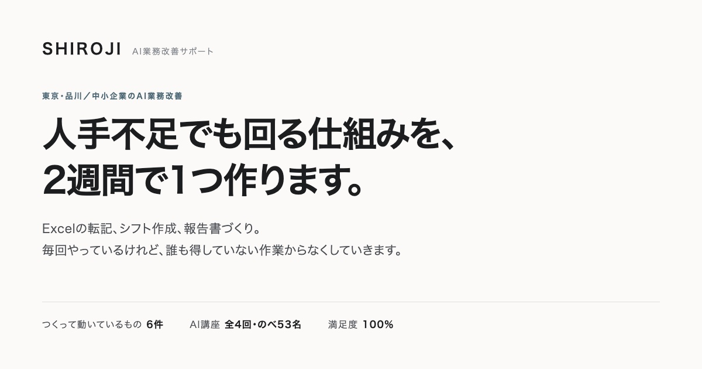
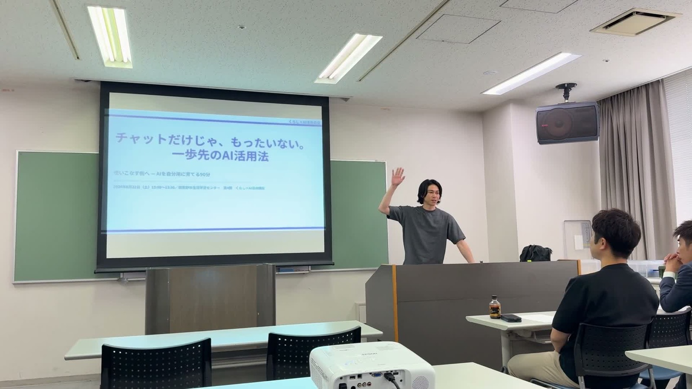

# ai-consul-tools

中小企業の「手入力」を減らすために、実際に作って動かしているツール集です。
Excelの転記、シフト作成、報告書づくり。**毎回やっているけれど、誰も得していない作業**を、1つずつ仕組みに置き換えてきた記録をまとめています。

すべて自分の業務、またはクライアント案件で**実際に稼働させたもの**です。
うまくいった構成だけでなく、途中で設計を変えた理由や踏んだ地雷も、各READMEに残しています。

**SHIROJI（白地）** ／ AIコンサルタント（業務改善）・土生 真大 ／ 東京都品川区

---

## ツール一覧

| ツール | 何を解決したか | 技術 | 状態 |
|---|---|---|---|
| [cost-management-tool](cost-management-tool/) | 原価が「なんとなく」だった状態を、毎月数字で出るように | スプレッドシート＋GAS | クライアント案件・運用中 |
| [shift-scheduler](shift-scheduler/) | 毎月のシフト作成にかかる時間を約3分の1に | Python / Streamlit | 運用中 |
| [sales-report-form](sales-report-form/) | 現場の実績報告を、役職者が手で打ち直す作業をなくした | GAS | 運用中 |
| [kpi-reporter](kpi-reporter/) | 週次の売上集計とレポート送信を自動化 | GAS | 運用中 |
| [meeting-bot](meeting-bot/) | 会議音声から議事録を作り、チャットへ自動投稿 | Python / Whisper / Claude | 運用中 |
| [ai-news-line-bot](ai-news-line-bot/) | 10ソースのAIニュースを毎朝7時にLINEへ配信 | GAS | 毎日稼働中 |
| [research-agent](research-agent/) | 5エージェント並列でWeb調査、本文まで読んで深掘り | Python | 運用中 |
| [local-transcriber](local-transcriber/) | 音声の文字起こしを、外部送信なしでMac内で完結 | faster-whisper | 運用中 |
| [slide-generator](slide-generator/) | 構成メモから、ブランド統一のPPTXを自動生成 | Node.js | 運用中 |
| [video-production](video-production/) | 縦型の告知動画を、会話ベースで制作・納品 | Claude Code スキル | 納品実績あり |
| [presentation-extensions](presentation-extensions/) | 登壇用のレーザーポインターとタイマー | Chrome拡張 (MV3) | 運用中 |
| [tokyo-art-events](tokyo-art-events/) | 14館の展覧会情報を毎日自動収集して公開 | GitHub Actions | [公開中](https://tokyo-art-events.vercel.app) |
| [landing-page](landing-page/) | 店舗の情報が1枚にまとまっていない状態を解消 | HTML / CSS | クライアント案件・公開中 |

---

## 主な事例

### 食材原価の見える化（飲食業・運用中）

仕入れ単価を更新すると、原価率・目標との差・適正販売価格・値上げアラートまでが自動で再計算されるスプレッドシート（5シート構成＋GAS連携）です。

- Googleフォームからのスマホ入力で、**伝票入力から原価率の更新までが一気通貫**
- 「値上げすべきか」の判断を1分以内にできる状態にした
- 導入した月に、**想定との差 [非公開]（[非公開]）のロス**が数字として表に出た
- v1→v8で潰した8つの設計上の問題（IFERRORで捕まらないバグ、最新単価を行順で判定していた構造欠陥など）を記録

> クライアント様の業務データを含むため、**設計の記録のみ**を公開しています。ソース・実物ファイルは含みません。

詳細 → [cost-management-tool/README.md](cost-management-tool/README.md)

### シフト作成の自動化（飲食業・2店舗で稼働中）

スタッフの希望休・イベント対応日をもとに、月間シフトの下書きを自動生成します。

- 手作業で行っていたシフト作成の時間が**約3分の1**に
- 勤務回数の公平性に配慮した割り当てロジック
- 専用UIで条件を入力するだけ。CSV出力に対応

詳細 → [shift-scheduler/README.md](shift-scheduler/README.md)

### 店舗ランディングページ（飲食業・公開中）

ブランドガイドラインがない状態から、実店舗の写真と公式SNSの実投稿を参照して世界観を組み立てたランディングページです。

- 掲載情報は予約サイト・公式サイト・プレスリリースを突き合わせ、**価格と営業時間の食い違いを確認してから**反映
- 正式な予約URLが未確定でも導線を殺さない暫定設計
- 依存なしの単一HTMLで、ホスティング先を選ばない構成

> クライアント様の店舗情報を含むため、**設計の記録のみ**を公開しています。実物のページは商談時に個別にお見せしています。

詳細 → [landing-page/README.md](landing-page/README.md)

---

## 登壇・研修

自治体の生涯学習センターで、市民向けのAI活用講座を主催・登壇しています。

- **全4回・のべ53名**が受講
- 満足度・分かりやすさともに**「満足以上」が100%**
- 受講後、ほぼ全員が「すぐ使えそう」と回答

講座の運営自体も、このリポジトリの [slide-generator](slide-generator/)・[presentation-extensions](presentation-extensions/)・[video-production](video-production/) で回しています。

---

## そのほかのツール

### 業務自動化

- **[meeting-bot](meeting-bot/)** — 会議音声をWhisperで文字起こしし、Claudeで議事録・要約を生成してGoogle Chatへ自動投稿。処理済みファイルは自動アーカイブ
- **[sales-report-form](sales-report-form/)** — 現場スタッフがスマホから実績を入力するGAS製フォーム。ホワイトリスト検証で不正入力を防ぎ、LockServiceで同時送信の競合を回避。kpi-reporterと組み合わせて「入力→蓄積→集計→送信」を一気通貫に
- **[kpi-reporter](kpi-reporter/)** — 週次の売上データを自動集計し、サマリーレポートを生成・送信するGASツール。時間主導型トリガーで自動実行

### 情報収集・リサーチ

- **[research-agent](research-agent/)** — Web・YouTube・Wikipedia・Reddit・トレンドの5エージェントが並列調査し、Round 1の結果からサブクエリを自動生成して深掘り。記事はスニペットではなく本文を全文取得。有料APIへの依存を意図的に排除（切替の経緯もREADMEに記録）
- **[ai-news-line-bot](ai-news-line-bot/)** — OpenAI・Google DeepMind公式ブログ、Hacker News、Reddit、ITmedia AI+など10ソースを横断収集し、英語タイトルは自動翻訳して毎朝7:00にLINEへ配信
- **[local-transcriber](local-transcriber/)** — faster-whisperによる音声の文字起こしをMac上で完結。外部に音声を送らずに済むため、機密性のある会議にも使える

### 制作・登壇支援

- **[slide-generator](slide-generator/)** — 構成メモをJSONで渡すだけでブランド統一のPPTXを生成。7種類のスライドタイプ、文字量に応じたフォントサイズ自動計算、`brand` の差し替えで企業向けにも転用可能
- **[video-production](video-production/)** — Claude Codeのスキルスタック（video-use + HyperFrames）による会話ベースの動画制作。実例として20秒の縦型告知動画（1080×1920）を制作・納品（実写合成／カラーグレード／トランジション／BGM選定）
- **[presentation-extensions](presentation-extensions/)** — 登壇用に自作したChrome拡張2種（Manifest V3）。iframe内のスライドでも動くレーザーポインターと、フルスクリーン対応のカウントダウンタイマー。外部通信なし・権限は最小限

### 公開Webサイト

- **[tokyo-art-events](tokyo-art-events/)** — 東京都内14館の展覧会情報をGitHub Actionsで毎日自動収集し、地図付きで一覧できる公開サイト。開催状況フィルタ・検索に対応 → [tokyo-art-events.vercel.app](https://tokyo-art-events.vercel.app)

---

## こんな方に

- シフト作成・売上集計など、定型業務に毎月まとまった時間を取られている
- 同じ情報を、Excelと自社サイトとポータルに何度も入力し直している
- 見積書や報告書の作成が、特定の人しかできない状態になっている
- AIを業務に取り入れたいが、何から始めればいいか分からない

## 作者

**土生 真大**（はぶ まさひろ）／ SHIROJI（白地）
AIコンサルタント（業務改善）・東京都品川区
2026年7月 個人事業主として開業

<!-- LP公開後にここへリンクを追加する: https://shiroji.jp/ -->

## 今後追加予定

- **sns-copy-generator** — 商品写真からSNS投稿文を自動生成
- **video-series** — 複数シーン動画の自動編集テンプレート
