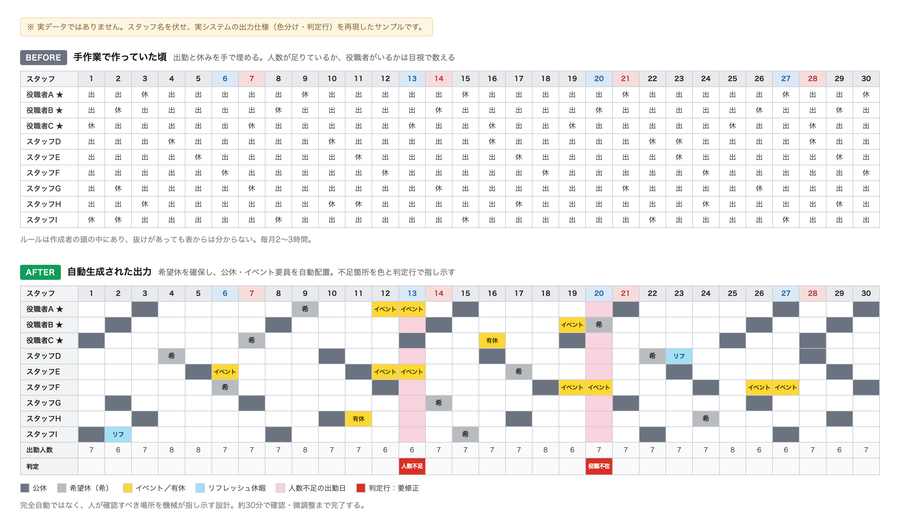

# shift-scheduler

飲食店の**月次シフト作成を自動化**した仕組み。
試作（Streamlit）から始め、**現場で回るGASシステム**に作り直して、現在2店舗で運用しています。

> スタッフの氏名・勤務データを扱うため、本番システム（GAS）のソースとスプレッドシートは非公開です。
> ここに残すのは設計判断と、現場に乗せるまでに必要だったことです。
> 試作版（Streamlit）のソースは本フォルダに含めています。

## 課題

シフト作成は、店舗業務の中でも**特に属人化しやすい仕事**です。

- 毎月、手作業で**2〜3時間**かかる
- 希望休の調整、人数不足のチェック、役職者の配置を**すべて人力で管理**
- ルールが作成者の頭の中にあり、**その人がいないと作れない**
- 作業量が多いため、後回しになって配布が遅れる

「時間がかかる」以上に、**特定の人しかできない状態**であることが問題でした。

## 到達点

**毎月2〜3時間かかっていたシフト作成が、約30分に。**
作業時間が1/4〜1/6になっただけでなく、**非エンジニアの店長がボタン操作だけで**シフト案を生成できる状態にしました。

削減できた時間そのものより、**作成できる人が1人から増えたこと**のほうが効いています。

### 出力の変化



*※ 実データではありません。スタッフ名を伏せ、実システムの出力仕様（色分け・判定行）を再現したサンプルです。*

手作業版（上）は、出勤と休みが並んでいるだけで、**人数が足りているか・役職者がいるかは目視で数える**しかありません。
自動生成版（下）は、希望休を確保したうえで公休とイベント要員を配置し、
**確認が必要な日だけを色と判定行で指し示します**。

Google Forms でスタッフから希望休を回収 → スプレッドシートに集約 → GASが配置ロジックを実行 →
色分けされたシフト案が出力される、という流れが自動で動きます。

## 実装した配置ロジック

| 機能 | 内容 |
|---|---|
| 希望休の優先配置 | フォームで集めた希望休を最優先で確保 |
| 公休の自動配置 | 月ごとの公休日数に合わせて残りを自動割当 |
| 連勤上限の制御 | 上限を超える連勤が発生しないよう配置 |
| 最低出勤人数の担保 | 平日／土日それぞれの必要人数を満たすか判定 |
| 役職者の配置 | 役職者不在の日が出ないよう配置・検知 |
| イベント要員の抽出 | 別会場の応援要員を担当優先度に従って配置（本部の人数カウントからは除外） |
| 有休・リフレッシュ休暇 | 公休とは別枠で加算。**取得日数はスタッフごとに異なる**ため、個人単位で扱う |
| 判定行 | 人数不足・役職者不在の日を色と判定行で可視化 |

**年間休日116日**を前提に、月ごとの公休日数（繁忙月とそれ以外で変わる）を設定シートで管理しています。

ここで効いてくるのが、**全員一律で計算できない**という点です。
有休とリフレッシュ休暇は取得日数がスタッフごとに違うため、
「全員に同じ日数の公休を割り当てる」という単純なロジックでは破綻します。
公休は月の日数から算出し、**個人ごとの休暇はその上に加算する**構造にしています。

人数・連勤上限などの具体的な設定値も、すべて設定シート側に置いています（下記）。

## 現場に乗せるために必要だったこと

自動化そのものより、**ここが本体**でした。

### 1. ハードコードを設定シートに逃がす

当初はイベント日程や休日数をコードに直接書いていましたが、
**毎月変わる値をコードに書くと、毎月エンジニアが必要になります。**

→ 公休日数・最大連勤・最低出勤人数・役職者要件・イベント日程を、すべて**設定シートから変更可能**に変更。
店長がスプレッドシートを書き換えるだけで運用が回るようになりました。

### 2. 自動配置より優先される「確定シフト」層を作る

現場には、ロジックで表現しきれない例外が必ず出ます（研修出勤、会社指定の休み、個別事情など）。

**自動生成を賢くしようとすると際限がありません。** そこで発想を変え、
**「確定シフト」シートを新設し、そこに書かれた内容は自動配置ロジックより優先**する構造にしました。

管理者が特定スタッフの出勤／公休／有休／リフを日付指定で強制でき、残りを自動配置が埋めます。
**例外を潰すのではなく、例外を置く場所を用意した**形です。

### 3. メニューを「運用フロー順」に並べ替える

機能単位で並べたメニューは、**作った本人にしか使えません。**

→ 実際の月次の流れに沿って再構成しました。

```
STEP1｜フォーム作成・配布
STEP2｜イベント日程を設定
STEP3｜管理者シフト（確定分）を登録
STEP4｜シフト案を生成
       （初回設定メニューは別枠に隔離）
```

店長が「今月どこから触ればいいか」で迷わなくなり、毎月の問い合わせが不要になりました。

### 4. 出力を色で読ませる

生成結果は、公休・希望休・イベント・有休・リフレッシュ休暇・**人数不足の日**を色分けして出力します。
赤い判定行で「人数不足／役職者不在」が一目で分かるため、**手直しが必要な箇所だけを見ればよい**状態です。

完全自動を目指さず、**「人が確認すべき場所を機械が指し示す」**設計にしています。

## 横展開できる形にする

テンプレート化により、新店舗への展開手順を確立しました。

```
1. テンプレートをコピー（GASコードも一緒に引き継がれる）
2. スタッフマスタを店舗の情報に書き換え
3. 設定シートで、その店舗のルールに値を調整
4. フォームを作成してスタッフへ共有
5. 回答が揃ったらシフト案を生成
```

**店舗ごとにコードを書き直す必要はありません。** ルールの違いは設定値で吸収します。

## 現在の状態

- **Phase 1｜自店舗**：完了・運用中
- **Phase 2｜同社の他2店舗**：展開中
- **Phase 3｜外部への提供**：今後

完成度は約75%。**未対応の部分も明記しておきます。**

| 残課題 | 現在の運用 |
|---|---|
| 人数不足・役職者不在の日の自動解消 | 色と判定行で可視化し、手動で修正 |
| 時短スタッフの終業時間の考慮 | 配置後に手動で調整 |
| 月またぎ連勤（前月末の連勤数） | 手動入力で引き継ぎ |

「全部自動化しました」ではなく、**手を入れるべき場所が特定できる状態**まで持っていった、というのが現在地です。

## 試作版（Streamlit）について

本フォルダの `shift_scheduler.py` は、GAS版に至る前の試作です。

```bash
pip install streamlit pandas
streamlit run shift_scheduler.py
```

4つのタブ（①スタッフ管理 → ②希望休入力 → ③イベント日設定 → ④シフト生成）を順に進めて、
月間シフトの下書きを生成し、CSVで出力します。

**この試作をそのまま現場に渡さなかった理由**が、この案件の要点でした。

- 店長のPCにPython環境を作る必要がある
- スタッフからの希望休回収が別手段になり、二度手間になる
- 出力がCSVで、そのまま掲示・共有できる形になっていない

**動くものを作ることと、現場で回ることは別**だと判断し、
すでに全員が日常的に使っているGoogle Forms／スプレッドシート上に作り直しました。

## 使った技術

- **本番**: Google Apps Script / Google Sheets / Google Forms
- **試作**: Python / Streamlit / pandas
